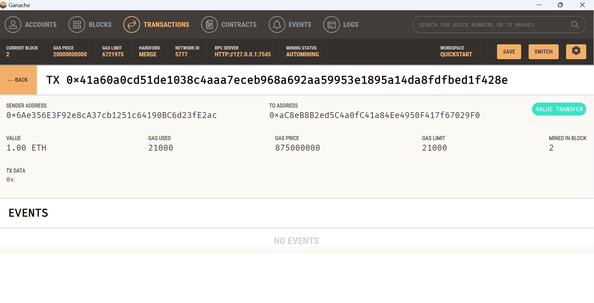

# KryptoJobs2Go
Module 19 

Instructions
The instructions for this Challenge are divided into the following high-level steps:

Import Ethereum transaction functions into the KryptoJobs2Go application.

Sign and run a payment transaction.

Inspect the transaction in Ganache.

